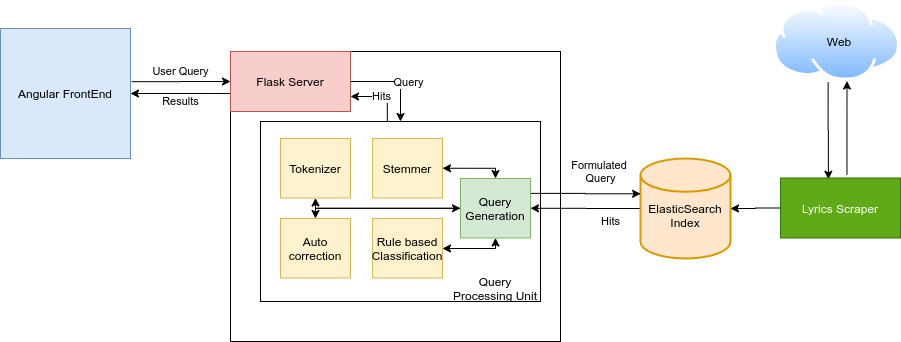

# IRProject-Sinhala-Song-Browser

## Introduction
This repo contains all code required for the implementation of a Sinhala Song Lyrics Engine for module CS4642. The search engine contains a collection of 1096 Sinhala Songs. The main functionalities of the search engine include

1. General Search Queries
2. Advanced field specific Search Queries
3. Faceting
4. Bilingual Support
5. Rule based Query classification

## Project Requirements
* Angular 8.3.23
* Python 3.6.9
* ElasticSearch 7.7.0

Additionally preimplemented tokenizers and stemmers from the following projects have been integrated
1. Tokenizer -  [Singling Tokenizer](https://github.com/ysenarath/sinling)  
2. Stemmer - [Sinhala Stemmer](https://github.com/shilpasayura/sinhala-nltk/tree/master/sinhala-stemmer)

The following Utility tools have also been used
1. Pipeline - [Scrapy ElasticSearch pipelin](https://github.com/jayzeng/scrapy-elasticsearch)
2. Import & Export tool for Elasticsearch - [Elasticdump](https://www.npmjs.com/package/elasticdump)

## Search Engine Architecture



## Project Structure

### 1. angularSE
Contains the code for the Angular 8 based Search Engine Implementation. Install all required dependencies by issuing the following command
```
npm install
```
Then issue the following command in this directory to run the Search Engine on port 4200
```
ng serve
```
### 2. esIndexBackup
Contains the backup files for the used elastic search analyzer, mapping and data use. Utilize the following commands to import the json file to an elasticSearch Index
```
elasticdump   --input=final_elasticsearch_<type>.json --output=http://<your-es-instance>/<your-index>   --type=<type>
```
### 3. lyricsScraper
Contains the Scrapy web crawler which was used to scrape web pages for music data.
```
pip install -r requirement.txt
```
Begin scraping by issuing the following command (-o tag is optional if you wish to add scraped data directory to a file)
```
scrapy crawl sinhalasongbook -o <optional_data_file>
```
The scraper automatcally sends data the specified elasticsearch index specified in the settings.py file
```
ELASTICSEARCH_SERVERS = ['localhost']
ELASTICSEARCH_INDEX = '<your-index>'
ELASTICSEARCH_INDEX_DATE_FORMAT = '%Y'
ELASTICSEARCH_TYPE = 'items'
ELASTICSEARCH_UNIQ_KEY = '<your-item-type>'
```
 
### 4. searchEngine
Contains the Flask server which is used to implement the backend server of the Search Engine. Install any requirements by using the following command
```
pip install -r requirement.txt
```
Use the following command to run the flask server on port 5000
```
python server.py
```

### 5. ScrapedData

* The `/original` sub-directory contains all scraped data in it's original format. The 11 json files contains upto 100 songs (2 pages worth of songs). This is limitation of 2 pages was chosen so as not to overburden the site from which songs were scraped during a scraping session. The json files are encoded in utf-16
* The `/edited` sub-directory contains the final formated corpus of all 1096 scraped in a single file format. 

View the structure of the data by clicking [here](scrapedData/README.md)

### 6. pythonHelpers

Contains any additional python scripts used for preformatting scraped data

