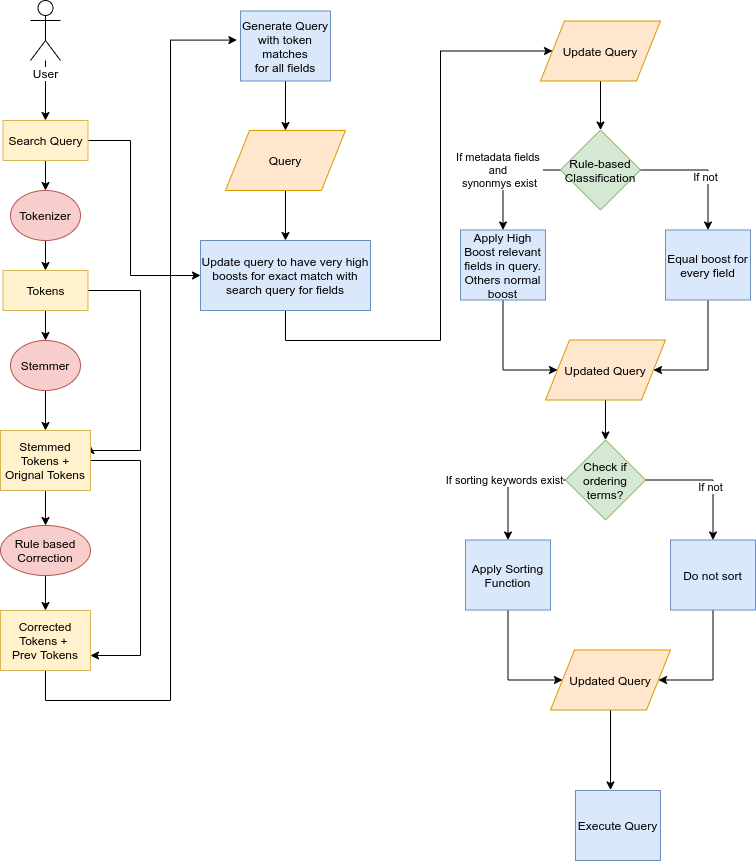

# IRProject-Sinhala-Song-Browser

## HIgh Level Flow diagram of SQG
 

## Design Decisions

### Used Analyzers in Index Generation
* For `songlyricsSearchable` field [ElasticSearch standard Analyzer](https://www.elastic.co/guide/en/elasticsearch/reference/current/analysis-standard-analyzer.html) was used
* For other fields a mixture of the [ElasticSearch ICU Tokenizer](https://www.elastic.co/guide/en/elasticsearch/plugins/current/analysis-icu-tokenizer.html) and [ElasticSearch edgeNgram](https://www.elastic.co/guide/en/elasticsearch/reference/current/analysis-edgengram-tokenfilter.html) filter was used
* In search time a Standard Analyzer was used.

### Query Generation
Points to note

* In client side query generation the Sinhala Tokenizer and Stemmer as mentioned in the previous page were used
* A custom rulebased correction algorithm and classification algorithm was used.

The Query generation process involved the following steps

1. Tokens generated in stemming and text correction were added back at each step. This was to ensure that if the user expected exact matches to their query their exact words would still remain within the final generated query.
2. The final query was created using [ElasticSearch Bool Query](https://www.elastic.co/guide/en/elasticsearch/reference/current/query-dsl-bool-query.html). A minium of 1 match within the subqueries within this compound query is expected
3. The subqueries and generated using 2 elasticsearch type queries namely. [Term Queries](https://www.elastic.co/guide/en/elasticsearch/reference/current/query-dsl-terms-query.html) and [Match Phrase Queries](https://www.elastic.co/guide/en/elasticsearch/reference/current/query-dsl-match-query-phrase.html). The generated tokens were used as the matching terms within Term Queries while the user's Exact input query was used for generating the Match Phrase Query.
4. Very High Boosts were given to match phrase queries
5. A Normal boost is given to the term queries. Based on the rule based classification aglorithm certain select fields are given slightly larger boosts
6. If ranking terms exist apply a boosting function to score outputs based on the view count of a song.